<h1 align="center"> Zeight Portrait Manager</h1>

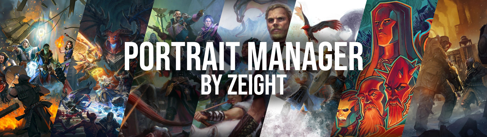

<h2 align="center">Desktop application for managing in-game portraits for Owlcat Games, inXile Entertainment and Obsidian Entertainment games</h2>

#### 
Click a title image below to open its Nexus Mods page

<table style="border:none; border-collapse:collapse; width:100%;">
<tr>
<td style="border:none; padding:0; width:50%;"><a href="https://www.nexusmods.com/pathfinderwrathoftherighteous/mods/466">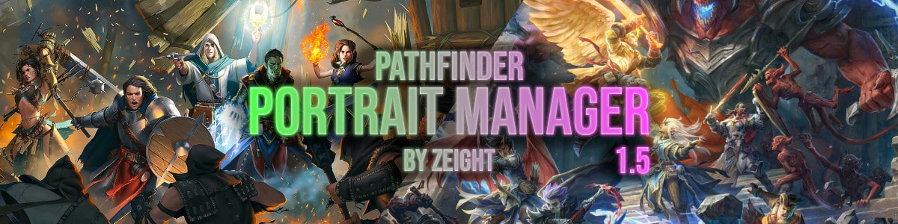</a></td>
<td style="border:none; padding:0; width:50%;"><a href="https://www.nexusmods.com/warhammer40kroguetrader/mods/120">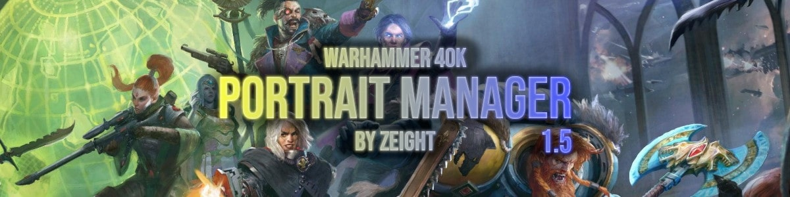</a></td>
</tr>
<tr>
<td style="border:none; padding:0;">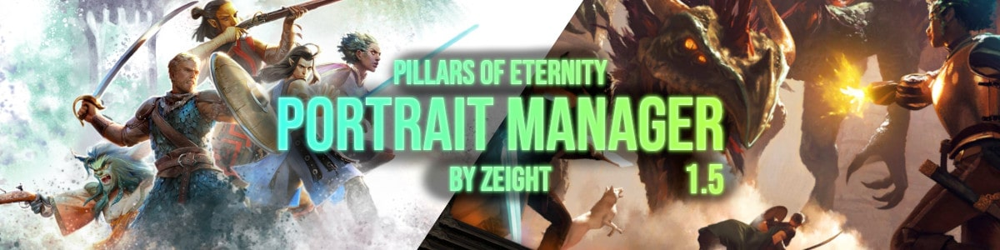</td>
<td style="border:none; padding:0;">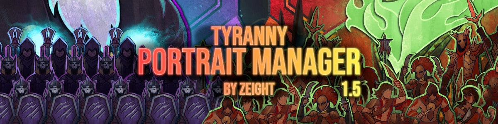</td>
</tr>
<tr>
<td style="border:none; padding:0;">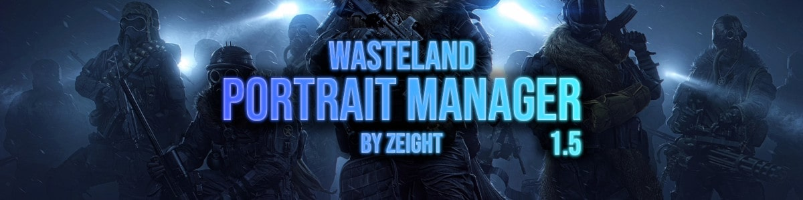</td>
<td style="border:none; padding:0;"></td>
</tr>
</table>

#### 
Created and designed by Artemii "Zeight" Saganenko Copyright Artemii Saganenko ©2023-2026

---

### Description
Zeight Portrait Manager is a lightweight Windows tool for creating, browsing, editing and extracting in-game character portraits across seven CRPGs from three developers: Owlcat Games (Pathfinder: Kingmaker, Pathfinder: Wrath of the Righteous, Warhammer 40,000: Rogue Trader), Obsidian Entertainment (Pillars of Eternity, Pillars of Eternity: Deadfire, Tyranny) and inXile Entertainment (Wasteland 3). It automatically locates each game's portrait folder, handles the cropping/resizing math for every portrait size the game expects, and writes files directly where the game will read them - no manual folder digging, no guessing dimensions.

Ships as a single self-contained `.exe`. Nothing to unpack, no companion DLLs to keep together, no installer. The only requirement is .NET Framework 4.8, which is already present on virtually every Windows 10/11 machine.

<table style="border:none; border-collapse:collapse; width:100%;">
<tr>
<td style="border:none; padding:0; width:33.33%;">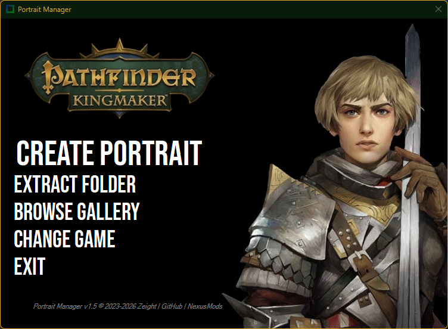</td>
<td style="border:none; padding:0; width:33.33%;">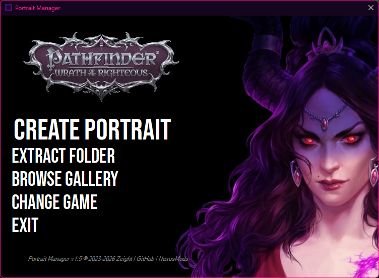</td>
<td style="border:none; padding:0; width:33.33%;">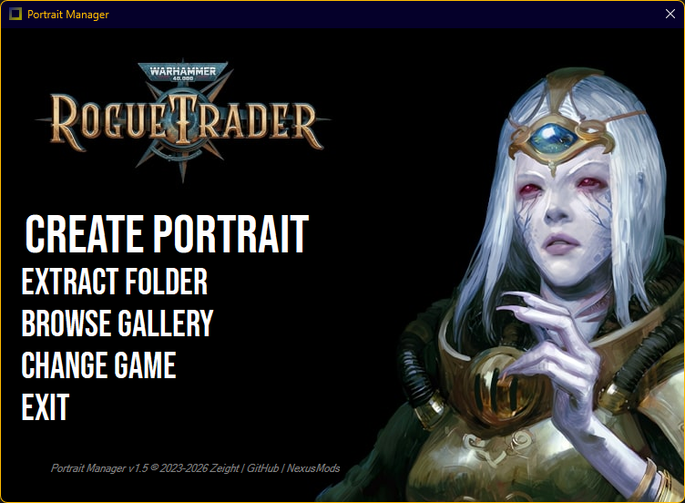</td>
</tr>
<tr>
<td style="border:none; padding:0;">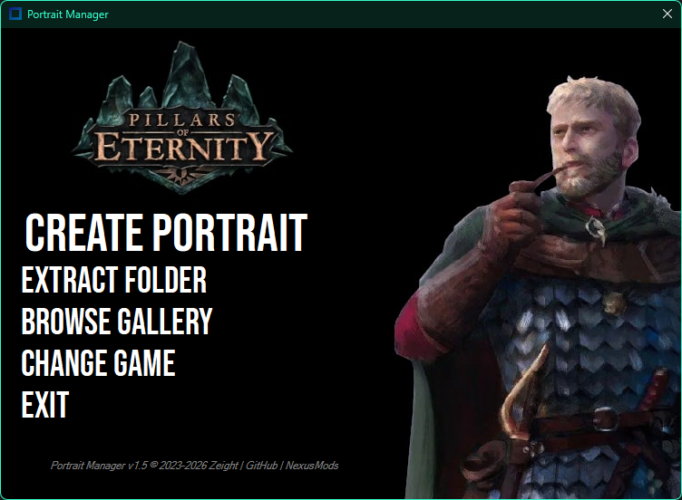</td>
<td style="border:none; padding:0;">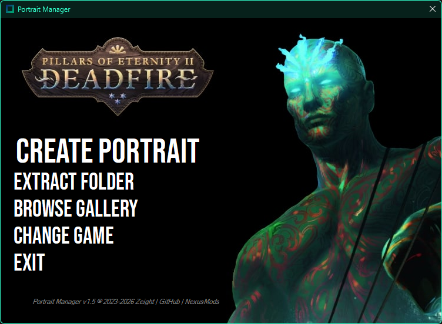</td>
<td style="border:none; padding:0;">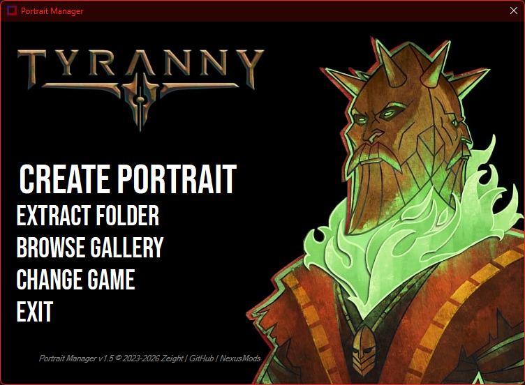</td>
</tr>
<tr>
<td style="border:none; padding:0;"></td>
<td style="border:none; padding:0;">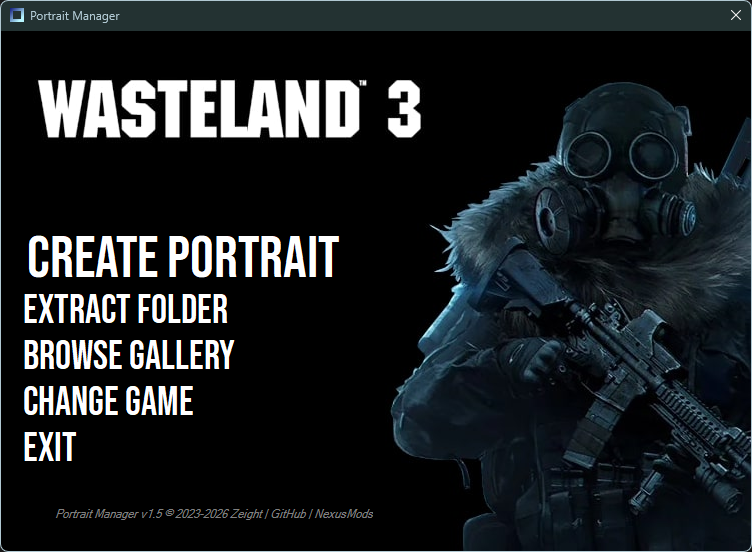</td>
<td style="border:none; padding:0;"></td>
</tr>
</table>

### Features

#### Create new portraits
Load an image from a local file or a web URL - drag-and-drop works too, either straight onto the portrait panel or as a pasted link. Zoom, pan and reset the crop with the mouse; each panel is shaped to the exact aspect ratio the game expects for that size, so what you see previewed is what gets written to disk. Press Create and Portrait Manager crops, resizes and saves every required size for that game in one pass, then shows a toast confirming where it landed with a one-click "open folder" link.

Prefer to pick the name yourself instead of an auto-generated one? Press Create with name instead of Create - it asks for a name first (duplicates are rejected on the spot) and then creates the portrait exactly like Create does.

<table style="border:none; border-collapse:collapse; width:100%;">
<tr>
<td style="border:none; padding:0; width:33.33%;">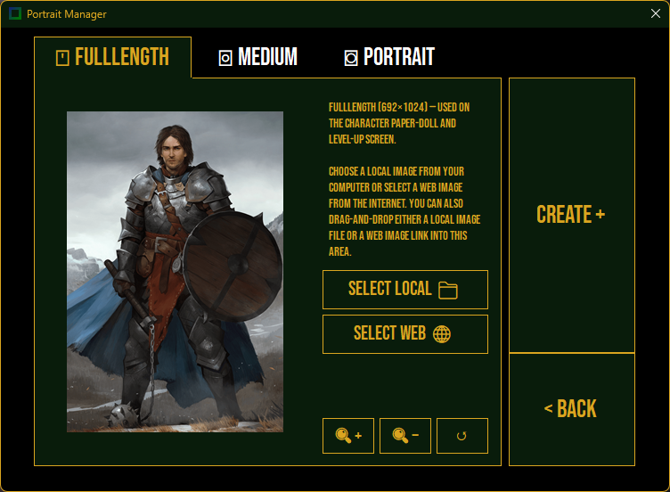</td>
<td style="border:none; padding:0; width:33.33%;">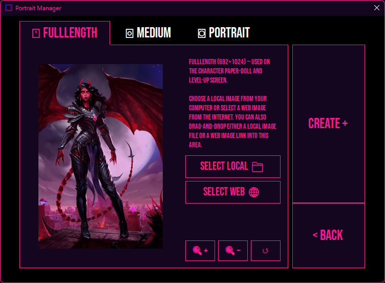</td>
<td style="border:none; padding:0; width:33.33%;">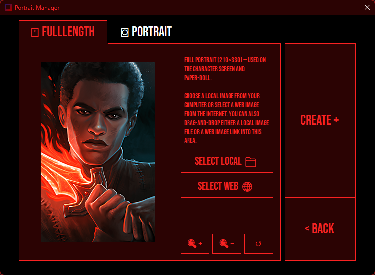</td>
</tr>
</table>

##### Portrait sizes per game

<table style="border:none; border-collapse:collapse; width:100%;">
<tr><th>Game</th><th>Small</th><th>Medium</th><th>Full</th></tr>
<tr><td>Pathfinder: Kingmaker</td><td>185×242</td><td>330×432</td><td>692×1024</td></tr>
<tr><td>Pathfinder: Wrath of the Righteous</td><td>185×242</td><td>330×432</td><td>692×1024</td></tr>
<tr><td>Warhammer 40,000: Rogue Trader</td><td>260×336</td><td>448×600</td><td>1080×1480</td></tr>
<tr><td>Pillars of Eternity</td><td>76×96</td><td>-</td><td>210×330</td></tr>
<tr><td>Tyranny</td><td>76×96</td><td>-</td><td>210×330</td></tr>
<tr><td>Pillars of Eternity: Deadfire</td><td>76×96 (×2 slots)</td><td>90×141</td><td>210×330</td></tr>
<tr><td>Wasteland 3</td><td>256×256</td><td>-</td><td>-</td></tr>
</table>

#### Extract portraits from a downloaded pack
Point Portrait Manager at a `.zip`, `.rar`, `.7z` archive, or a plain unpacked folder - drag-and-drop, or right-click for a folder picker. It scans recursively, matches every image against the sizes above, and lets you extract everything at once or hand-pick individual portraits from the grid. Anything that isn't PNG already gets converted on the way out, so mixed-format packs (PNG/JPG/GIF/BMP) just work.

<table style="border:none; border-collapse:collapse; width:100%;">
<tr>
<td style="border:none; padding:0; width:50%;">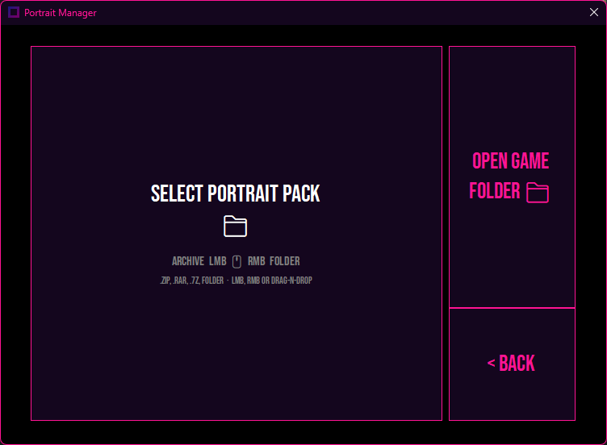</td>
<td style="border:none; padding:0; width:50%;">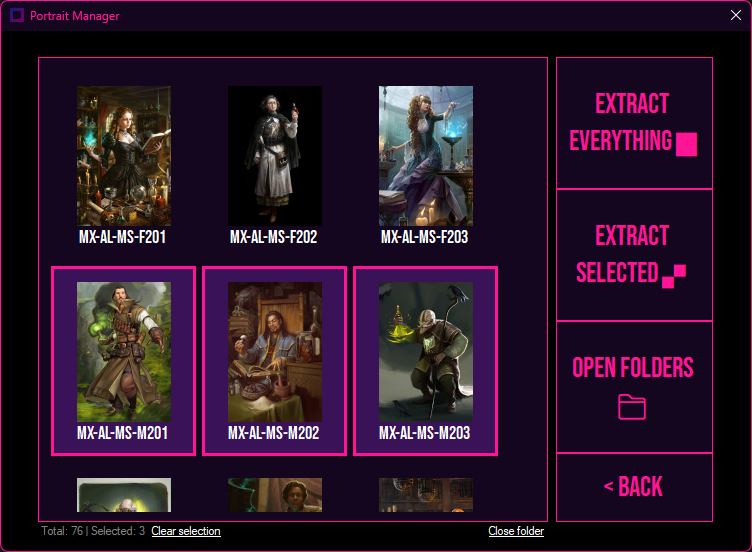</td>
</tr>
</table>

#### Browse gallery
Every existing portrait - player, companion, or NPC - shows up in Browse Gallery as a thumbnail grid. **Clone** duplicates a portrait as a brand-new one without touching the original. **Change** replaces it in place with a new image, so a portrait already in use by an active save updates immediately with no save-editing required. **Delete** removes it, with a confirmation first. Any in-place change automatically backs up the untouched original before overwriting, so nothing is ever lost to a bad edit.

<table style="border:none; border-collapse:collapse; width:100%;">
<tr>
<td style="border:none; padding:0; width:33.33%;">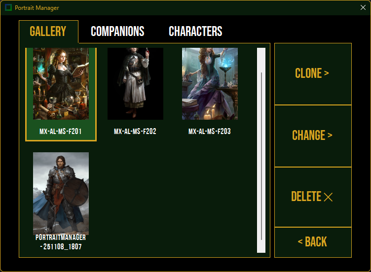</td>
<td style="border:none; padding:0; width:33.33%;">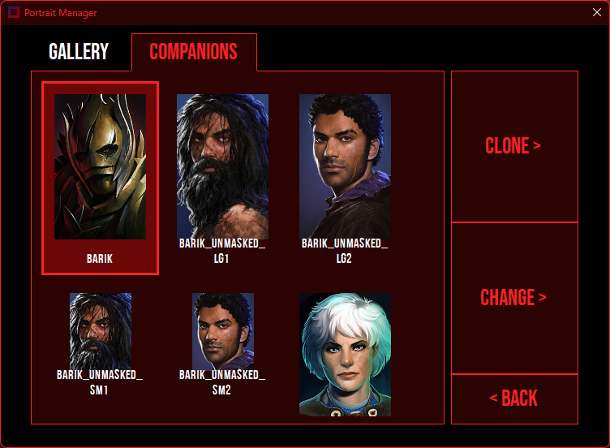</td>
<td style="border:none; padding:0; width:33.33%;">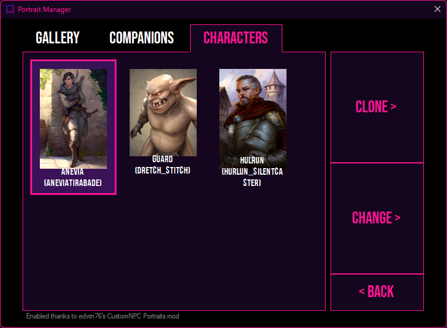</td>
</tr>
</table>

#### Companion & character portraits
This is the part that differs the most from game to game, because it depends on how each game actually stores that data:

**Pathfinder: Kingmaker** relies on edvin76's [CustomNpcPortraits](https://github.com/edvin76/CustomNpcPortraits) mod. That mod only creates a portrait folder for a companion or NPC the first time you meet them in-game (or if you've installed a pre-made folder pack) - Portrait Manager can't create those folders itself, only edit what the mod has already created. Once they exist, Browse Gallery splits them into a **Companions** tab and a **Characters** tab automatically.

<table style="border:none; border-collapse:collapse;">
<tr>
<td style="border:none; padding:0;">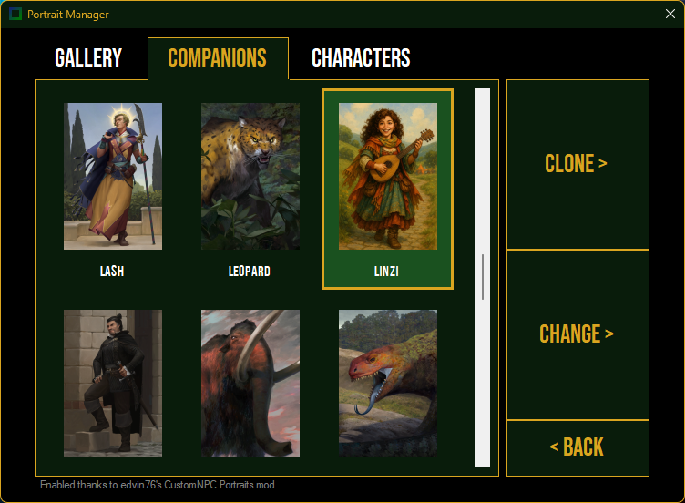</td>
<td style="border:none; padding:0;">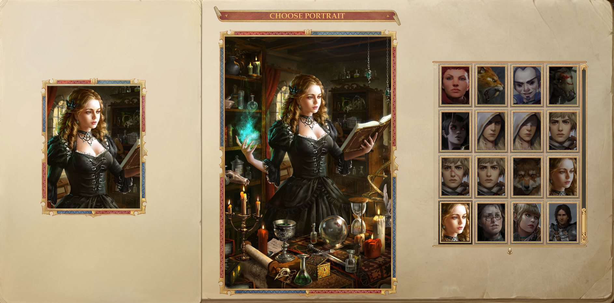</td>
<td style="border:none; padding:0;">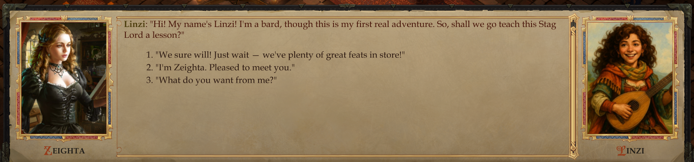</td>
</tr>
</table>

**Pathfinder: Wrath of the Righteous** uses the same CustomNpcPortraits mod and Companions/Characters tab layout as Kingmaker.

*(mind the CustomNPC)* In Wrath of the Righteous specifically, the game overwrites the Main Character's own portrait, so a custom portrait applied to the MC through CustomNpcPortraits stops working once you're back in-game. To make it stick, apply/change it through the companion entry named "CustomNpcPortraits - {your MC's name}" instead.

<table style="border:none; border-collapse:collapse;">
<tr>
<td style="border:none; padding:0;">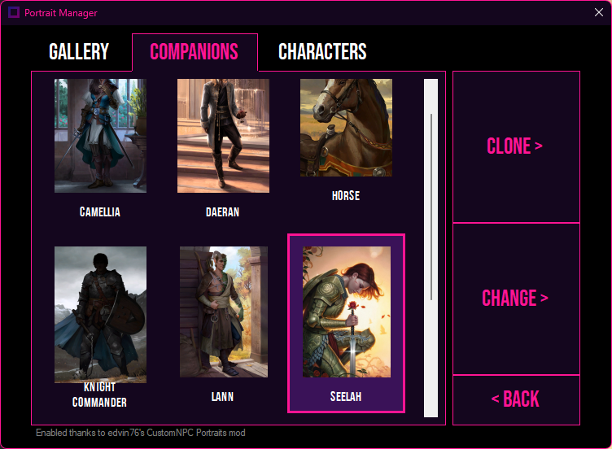</td>
<td style="border:none; padding:0;">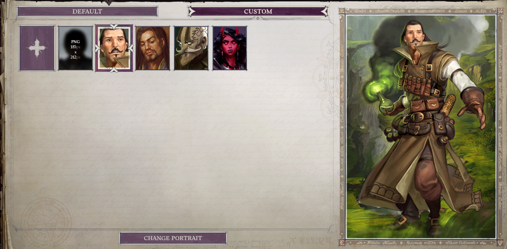</td>
<td style="border:none; padding:0;">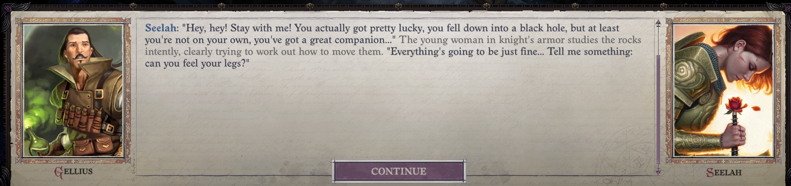</td>
</tr>
</table>

**Pillars of Eternity** ships its companion and NPC portraits directly in the base install - no mod needed. Portrait Manager exposes them under a single merged **Companions** tab.

<table style="border:none; border-collapse:collapse;">
<tr>
<td style="border:none; padding:0;">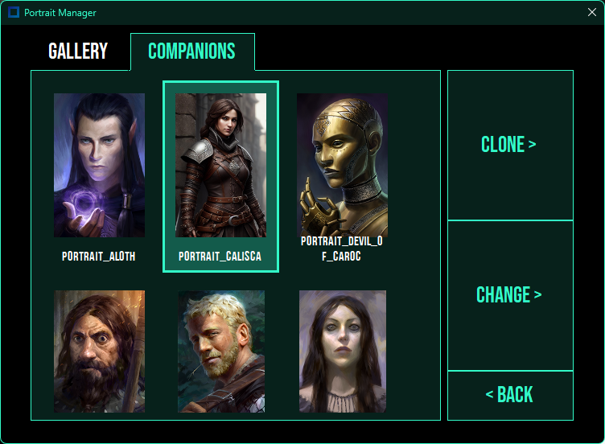</td>
<td style="border:none; padding:0;">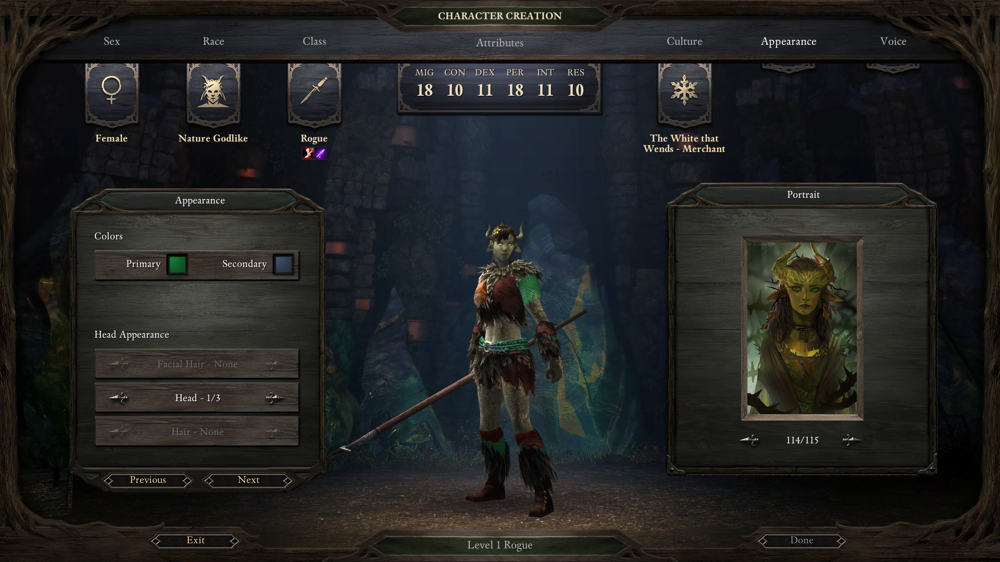</td>
<td style="border:none; padding:0;">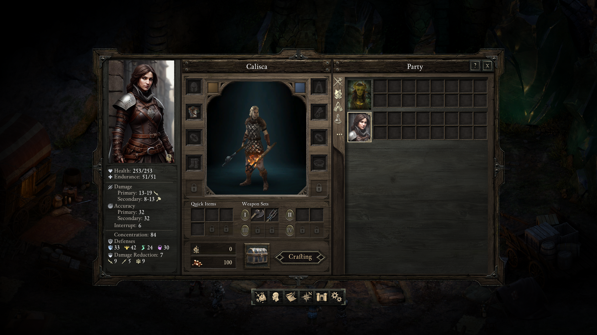</td>
</tr>
</table>

**Pillars of Eternity: Deadfire** works virtually the same as Pillars of Eternity and Tyranny below, just more complete: the base game already keeps companions and NPCs in separate folders on disk, so Portrait Manager gives Deadfire its own dedicated **Companions** and **Characters** tabs too, the same convenience Kingmaker/WotR get from a mod, with zero mod dependency.

<table style="border:none; border-collapse:collapse;">
<tr>
<td style="border:none; padding:0;">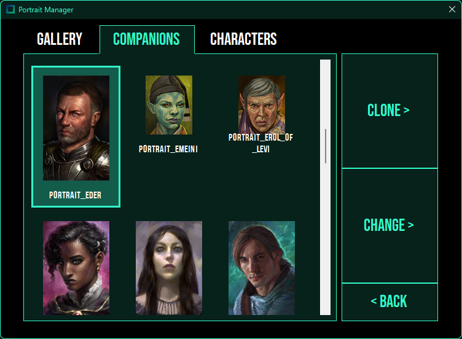</td>
<td style="border:none; padding:0;">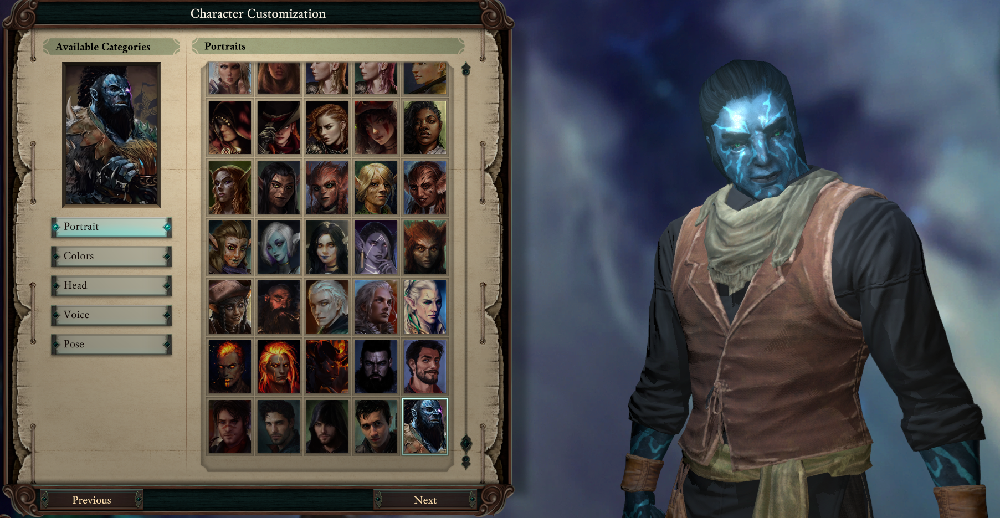</td>
<td style="border:none; padding:0;">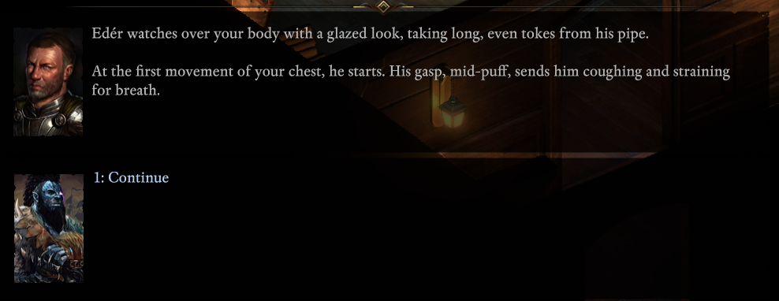</td>
</tr>
</table>

**Tyranny** ships its companion portraits directly in the base install too, merged into a single **Companions** tab, same as Pillars of Eternity.

<table style="border:none; border-collapse:collapse;">
<tr>
<td style="border:none; padding:0;">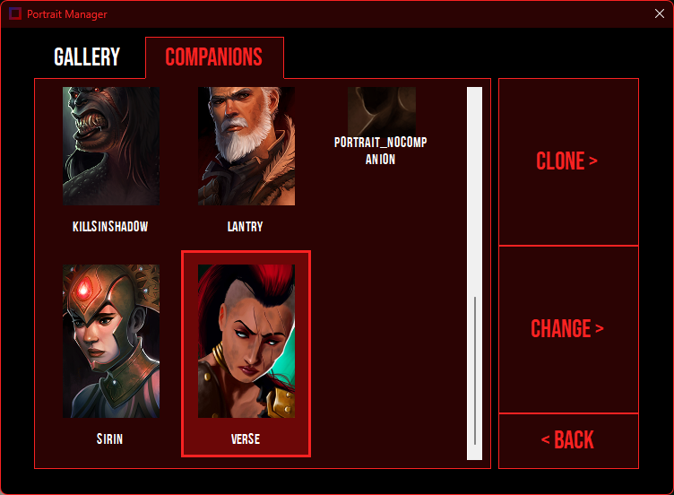</td>
<td style="border:none; padding:0;">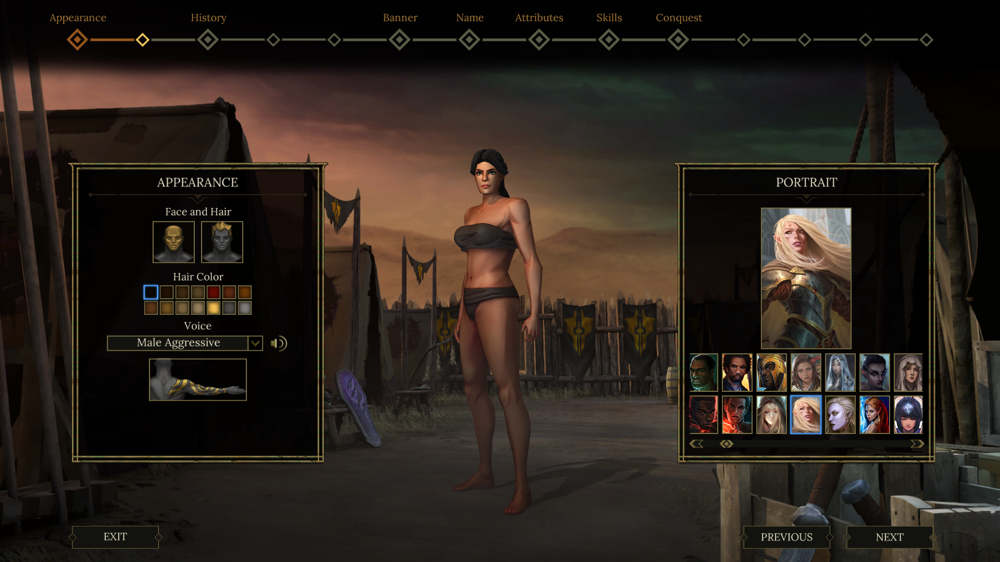</td>
<td style="border:none; padding:0;">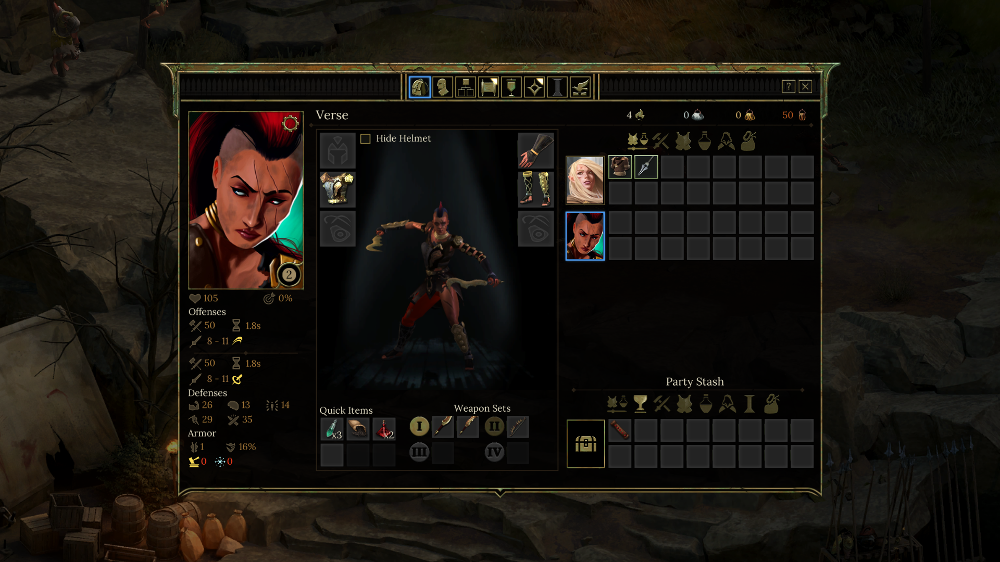</td>
</tr>
</table>

**Warhammer 40,000: Rogue Trader & Wasteland 3** don't expose a companion/NPC portrait system Portrait Manager can reach (Rogue Trader has no equivalent mod yet; Wasteland 3's custom-portraits folder is player-only), so Browse Gallery for those games only shows the player tab.

### Basic use cases

**Extract portraits from a downloaded pack**
1. Download a portrait pack for your game (Nexus Mods is the usual source - see the credits below for examples).
2. Unpack it somewhere writable, if it isn't a `.zip`/`.rar`/`.7z` you're pointing straight at.
3. Launch Portrait Manager, pick the game, press Extract folder, and point it at the pack.
4. Extract everything, or select individual portraits and extract just those.
5. Launch the game and enjoy.

**Create a portrait from a local or web image**
1. Pick the game, press Create portrait.
2. Choose local (browse your files) or web (paste a link), then load the image.
3. Zoom/pan to crop it the way you want - the panel already matches the game's aspect ratio.
4. Repeat for each portrait size the game uses, then press Create.
5. The new portrait is saved and shows up in Browse Gallery immediately.

**Edit a companion or NPC portrait**
1. For Kingmaker/WotR: install [CustomNpcPortraits](https://github.com/edvin76/CustomNpcPortraits) and meet the character in-game at least once (or use a pre-made folder pack). For Deadfire, PoE1 or Tyranny, nothing extra is needed - skip to step 2.
2. In Portrait Manager, open Browse Gallery, switch to the Companions or Characters tab, and find the character.
3. Press Change and pick a new image. The very first time you edit that character, the untouched original is backed up automatically, the same way Create portrait preserves what was there before.
4. Adjust and confirm like any other portrait creation.
5. Changed your mind later? Press Change again and you'll be offered to restore that original backup instead of building on top of your last edit - it's kept exactly as it was, for as long as you want.
6. Launch the game - the change is already live, no save-editing needed.

### Installation
Download `Portrait Manager.exe` and run it from anywhere - it's fully self-contained, so there's nothing else to copy alongside it. Settings (game paths, window size, last-used game) are stored per-user under your Windows AppData folder, not next to the executable, so moving or renaming the `.exe` is safe.

Requires .NET Framework 4.8. If you're on a reasonably current Windows 10 or Windows 11 install, you already have it.

### Build info
* C#, .NET Framework 4.8, Visual Studio 2022
* Single self-contained `.exe` - all dependencies embedded via Costura.Fody, nothing to distribute separately
* Release builds have debug symbols stripped

#### Addendum
Small technical notes that aren't covered above, but worth knowing if something looks unexpected:

* **Localization**: the UI can be switched between English, German and Russian using the small flags in the top-right corner of the window. The language is never auto-detected from the OS - it defaults to English and only changes when you click a flag, and your choice is remembered for next launch.
* **CustomNPC has no in-game binding from this app**: Portrait Manager only writes image files to disk; it has no pipeline of its own to make the game display a given folder as a specific companion or NPC. The folder's name has to match that character's exact in-game dialogue name for CustomNpcPortraits to pick it up - that matching is entirely the mod's job, not Portrait Manager's.
* **Settings storage**: game path, last-used game, and now language are stored per-user as XML under your Windows AppData folder, the same mechanism used in the previous release - not next to the executable.

##### Changelog
* 1.5 (current)
    * Major visual, conceptual and functional overhaul
    * Added full support for Pillars of Eternity, Pillars of Eternity: Deadfire, Tyranny and Wasteland 3
    * Added a backup-and-restore system for companion/character portraits: the untouched original is preserved automatically on first edit and offered back on later edits
    * Reintroduced localization: English, German and Russian, switchable via flags in the top-right corner. Unlike 1.2.0.0, the language is never auto-detected from the system - it defaults to English and remembers your last choice
    * Added Create with name - choose your own folder/file name for a new portrait instead of an auto-generated one, with duplicate names rejected up front
    * Added a per-game help button on the Browse Gallery page explaining that page's tabs and behavior
    * Major internal refactor touching nearly every part of the codebase: code split by responsibility (UI events, business logic, image/file operations), all user-facing text centralized, dead code removed
    * Fixed several silent failures (corrupt/unsupported image loads, failed deletes) to surface a plain-language message instead of doing nothing
* 1.3.5.0 (previous)
    * Added Warhammer 40000: Rogue Trader full support. It does not support CustomNPC
    * Re-verified all translations and typings. No linguist is involved, so minor mistakes can be found. I consider nothing crucial, but expect no flawlessness in the matter
    * Minor refactoring, nothing of interest for users. Plus tiny optimization tweaks
    * Minor graphical changes, now all languages support Bebas Neue font, some margins, paddings adjusted, fixed buttons' and labels' text from being hidden from sight
    * Added keyboard events and legends for them. Now users are able to navigate the tool using keyboard, including dialogs/modal forms and main form, except settings page
    * Settings page back button, now restarts application
    * Transferred from .NET Framework 4.7.2 to .NET Framework 4.8. Nothing changed for users
    * Increased program size. (~7.5 Mb)
* 1.2.0.0
    * Added asynchronous loading of Browse Gallery and Extract Folder. Loading of images on these pages is faster and I/O-free, allowing more smooth and convenient experience
    * Added Custom NPC Portraits support. Added support for portraits created by edvin76's mod. Portraits of both the army and NPCs can be altered using this application
    * Major code refactoring
    * Optimization changes
    * The concept of localization has been changed. Now you can change the localization using the buttons on the main page. Initial localization depends on the system language
    * Currently available localizations: en-US, ru-RU, de-DE, the latter one is translated by AI, so it is flawed
    * Changes in the settings page
    * Added fault tolerance for Extract Folder, so partially incorrect portraits are still processed by a program
* 1.1.0.0b (deprecated)
    * Minor graphical changes
    * Optimization changes
    * Code refactored
    * Added localization support, now includes translation file for Russian language
    * Removed unnecessary if/else on image zooming
    * Removed dependency on outdated folder chose dialog, swapped to new FolderBrowserDialog
    * Added settings page to set up portrait folder path for each game type and to resize window
    * Added features that allow user to change every portrait separately
* 1.0.0.2e (deprecated)
    * Create new portrait from image
    * Scale image as you see them fit as portraits
    * Change existing portrait(s)
    * Delete existing portrait(s)
    * Browse existing portrait(s)
    * Extract image(s) from another folder

### Copyrights

**Tools & license**
1. Program license: GPL-2.0, conditions listed in [LICENSE](https://github.com/zeightOFFICIAL/portrait-manager/blob/master/LICENSE)
2. Visual Studio 2022 belongs to Microsoft (https://visualstudio.microsoft.com/vs/)

**Games**
1. Pathfinder: Kingmaker belongs to Owlcat Games (https://kingmaker.owlcat.games/)
2. Pathfinder: Wrath of the Righteous belongs to Owlcat Games (https://wrath.owlcat.games)
3. Warhammer 40000: Rogue Trader belongs to Owlcat Games (https://roguetrader.owlcat.games/)
4. Pillars of Eternity belongs to Obsidian Entertainment (https://www.obsidian.net/games/pillars-of-eternity)
5. Pillars of Eternity: Deadfire belongs to Obsidian Entertainment (https://www.obsidian.net/games/pillars-of-eternity-ii-deadfire)
6. Tyranny belongs to Obsidian Entertainment (https://www.obsidian.net/games/tyranny)
7. Wasteland 3 belongs to inXile Entertainment (https://www.inxile-entertainment.com/games/wasteland-3)

**Assets**
1. Images and icons used in the program belong to Owlcat Games, Obsidian Entertainment, or inXile Entertainment, unless stated otherwise
2. Font Bebas Neue belongs to its creator Ryoichi Tsunekawa (https://fonts.google.com/specimen/Bebas+Neue, https://dharmatype.com/bebas-neue)
3. Font Bebas Neue for Cyrillic belongs to its creator Ryoichi Tsunekawa and AA (https://fonts-online.ru/fonts/bebas-neue-cyrillic, https://dharmatype.com/bebas-neue)

**Mods & portrait packs referenced or used for testing**
1. Custom Npc Portraits (https://www.nexusmods.com/pathfinderwrathoftherighteous/mods/346, https://www.nexusmods.com/pathfinderkingmaker/mods/100) belongs to Nexus Mods (https://www.nexusmods.com/) and edvin76 (https://www.nexusmods.com/pathfinderkingmaker/users/1599293), (https://github.com/edvin76/CustomNpcPortraits). None of Custom Npc Portraits' assets are used, just its result - I am not in cooperation with edvin76, but respect the work. If any question arises, contact me by listed email
2. Portrait pack https://www.nexusmods.com/pathfinderkingmaker/mods/92 belongs to Nexus Mods (https://www.nexusmods.com/) and Citrus457 (https://www.nexusmods.com/pathfinderkingmaker/users/60287596)
3. Portrait pack https://www.nexusmods.com/warhammer40kroguetrader/mods/50 belongs to Nexus Mods (https://www.nexusmods.com/) and garion85 (https://www.nexusmods.com/warhammer40kroguetrader/users/84847078)
4. Portrait pack https://www.nexusmods.com/pillarsofeternity/mods/72 belongs to Nexus Mods (https://www.nexusmods.com/) and helldvan (https://www.nexusmods.com/pillarsofeternity/users/2688779)
5. Portrait pack https://www.nexusmods.com/pillarsofeternity2/mods/276 (MQ Portraits Pack) belongs to Nexus Mods (https://www.nexusmods.com/) and MaxQuest (https://www.nexusmods.com/pillarsofeternity2/users/1963564)
6. Portrait pack https://www.nexusmods.com/tyranny/mods/36 (Garion's Portrait Pack - Tyranny) belongs to Nexus Mods (https://www.nexusmods.com/) and garion85 (https://www.nexusmods.com/tyranny/users/84847078)
7. Portrait pack https://www.nexusmods.com/wasteland3/mods/5 (Wasteland 3 - Lore Friendly Custom Portraits) belongs to Nexus Mods (https://www.nexusmods.com/) and Kerem (https://www.nexusmods.com/wasteland3/users/2205741)
8. Placeholder portrait image for Pillars of Eternity - Nature Godlike by telthona (https://www.deviantart.com/telthona/art/Nature-Godlike-655455075)

<b>Inform me if your ownership rights have been violated, if you encounter any errors, or if you have suggestions for improving functionality or optimization - I'm open to any of it.

Disclaimer: this is not a product of Owlcat Games, Obsidian Entertainment or inXile Entertainment. It's developed independently by a third party with no affiliation to any of them, and I'm not responsible for bugs or issues in your games caused by this software - use it as-is, no warranty. Any image processed by this software belongs to whoever it belonged to before you opened it here; the tool does not inspect, judge, or alter image content beyond resizing/cropping, and selecting an image plus everything that follows from that choice is entirely on the user. Custom Npc Portraits belongs to edvin76, not me - I don't use or redistribute any of its assets, only interoperate with the folders it creates.</b>
